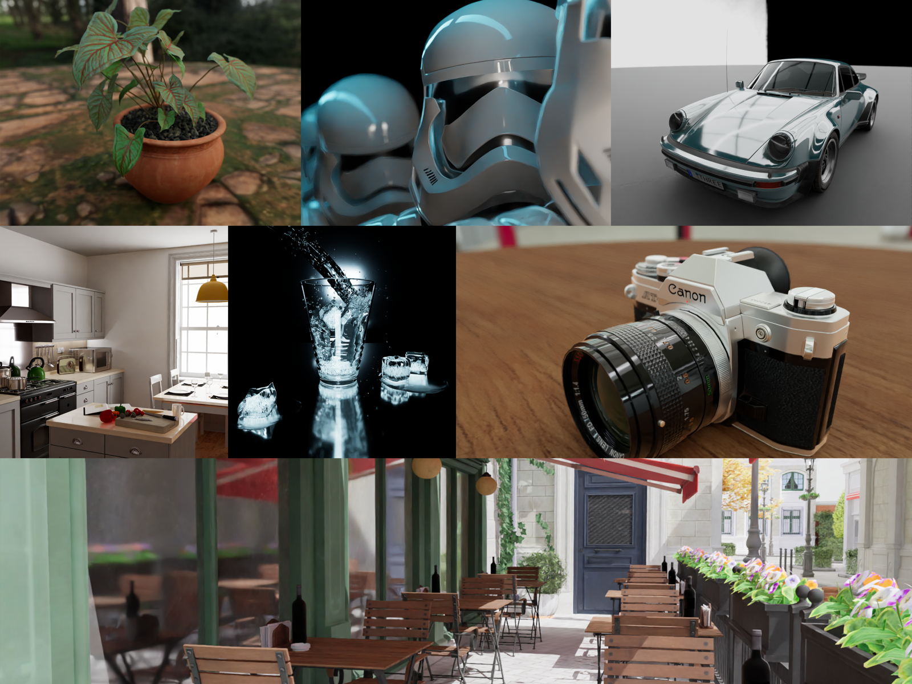

# Rayzee - Real-Time Path Tracer

[![NPM Package][npm]][npm-url]
[![Build Size][build-size]][build-size-url]
[![NPM Downloads][npm-downloads]][npmtrends-url]
[![jsDelivr Downloads][jsdelivr-downloads]][jsdelivr-url]

A real-time path tracer that runs entirely in the browser. Rayzee combines a WebGPU wavefront Monte Carlo core, a two-level BVH, and TSL shaders compiled to WGSL to deliver physically based global illumination with interactive frame rates.

<p align="center">
  
</p>

🌐 **[Launch App](https://atul-mourya.github.io/rayzee-renderer/)**

The project is a monorepo with two packages: **`rayzee/`** — the standalone rendering engine, publishable to npm — and **`app/`** — the React UI built on top of it. External clients can use the engine independently:

```js
import { PathTracerApp } from 'rayzee';               // the full engine, as the app uses it
import { RayzeeRenderer } from 'rayzee/core';         // or just the renderer, about 40 % smaller
```

The renderer core takes optional add-ons — physical sky, scene archives, bidirectional path tracing, OpenColorIO
colour, on-disk storage — from `rayzee/addons/*`: how to install each is in
[rayzee/README.md → Add-ons](rayzee/README.md#add-ons), the layer rules in [docs/CORE_AND_ADDONS.md](docs/CORE_AND_ADDONS.md). Two runnable
examples, in Node and in a page, are in [`rayzee/examples/`](rayzee/examples).
See **[rayzee/README.md](rayzee/README.md)** for the full engine API reference — installation, framework integration, managers, events, and custom pipeline stages.

## Highlights

- **Wavefront path tracer** — decomposed `generate → extend → shade → compact` compute kernels with stream compaction, driving a Monte Carlo core with configurable multi-bounce transport and progressive accumulation
- **Two-level BVH** — SAH-built TLAS/BLAS acceleration structure, constructed off the main thread via Web Workers so scene loads don't block rendering, with O(N) refit for animated and transformed geometry
- **Instanced geometry** — a geometry used by several objects is stored once in its own space and placed by matrix, so a scene of repeated furniture costs one copy rather than one per placement; geometry used once, or geometry that emits light, is baked to world space instead so rays skip the transform entirely
- **Real-time + final-quality denoising** — ASVGF spatiotemporal filtering or a port of NVIDIA NRD's ReBLUR for interactive navigation, a lighter spatial-only edge-aware à-trous filter when temporal reuse is unwanted, and Intel Open Image Denoise (OIDN) for clean final renders or as the live viewport denoiser (fed a reprojected motion history while the view moves, which roughly halves its boiling), running as a native WGSL U-Net on the renderer's own GPU device with FP16 inference where the hardware allows
- **Neural upscaling** — a finished render can be enlarged 2x or 4x by Real-ESRGAN rather than traced at full size. It runs once, when the render completes, on the denoised result
- **Bidirectional path tracing and vertex merging** — opt-in integrators that also trace light from every source (glowing surfaces, lamps, the sun, the sky): caustics, light through small openings, and caustics seen in mirrors and through glass
- **HDR image-based lighting** with CDF importance sampling for accurate, noise-efficient environment illumination
- **Physical sky** — a spectral clear-sky atmosphere (air, haze, ozone, light scattered many times over, the ground's bounce) with a sun that is drawn and sampled as a light of its own, placed by time of day, month and latitude; it is rebuilt on the GPU fast enough to follow the Time of Day slider frame by frame
- **Full PBR material pipeline** with live, real-time editing of materials, camera, depth of field, and environment — no re-render required to see a change
- **Depth of field** with photographic controls (focal length, aperture, focus distance) and click-to-focus
- **Orthographic camera** — parallel projection for elevations, plans and isometric views, with the view's height set in metres or by scrolling; every denoiser, depth of field and auto-focus work in it, and orthographic cameras in glTF and pbrt files import as such
- **360° equirectangular panorama** camera projection, with longitude/latitude range cropping and a level-horizon option
- **Fast Navigation** — renders at lower resolution while the camera moves and restores full quality the moment you stop, keeping navigation responsive
- **Walk mode** — first-person navigation for interiors and large scenes: drag to look, walk at eye height with the keyboard, at a speed set in metres per second; switching back to orbit circles whatever you were looking at
- **Camera keyframes** — key the camera's view at chosen times and it glides through them, keeping what they look at in frame; preview the move in the viewport, then render it as a video of a still scene or alongside a model's own animation
- **Broad asset support** — GLB, GLTF, FBX, OBJ, STL, PLY, DAE, 3MF, and USDZ models; HDR/EXR environments; ZIP archives with automatic model detection
- **Scenes larger than memory** — a pbrt-v4 archive of tens of gigabytes can be inspected without unpacking it and loaded one element at a time; triangle and node storage is chunked past the browser's ~2 GB single-array ceiling, triangles are split across two GPU buffers to pass WebGPU's 4 GB buffer limit, and a CPU memory preflight refuses a scene that would kill the tab rather than letting it die mid-build. With the experimental memory spill, a large scene is built through disk, and 80 million stored triangles (a large part of Disney's Moana island) load and render in one tab
- **Saved on disk** — downloads, unpacked archives, built scenes and environment tables are cached in the browser's private file system, so loading them again is quicker; the session is saved as you work and offered back on return; a project saves to a `.rayzee` file with the local model inside; and a long final render or video export resumes where it stopped
- **OpenColorIO colour management** — opens in Blender 5.1's own config (AgX, Medium High Contrast), with its views, looks and displays, ACES configs, or a studio's own config folder; render in ACEScg or another working space, set per-texture colour spaces, and save EXR in a delivery space. The default look ships pre-built, so the first frame needs neither the colour runtime nor its download. Exposure in stops, with automatic exposure
- **Blender-accurate shading** — exact Fresnel on glass, paint and plastic, sharp highlights at their true peak, scale-aware ray start points so light does not leak out of small crevices, and Cycles' shadow-terminator offset for low-poly curved meshes; a glossy black sphere matches Cycles within 1 % at every angle

## Tech Stack

| Category | Technologies |
|----------|-------------|
| **Frontend** | React 19, Vite 8, TailwindCSS 4 |
| **3D Rendering** | Three.js 0.186+, WebGPU, TSL Shaders (WGSL) |
| **UI Components** | Radix UI, Lucide Icons |
| **State Management** | Zustand |
| **Denoising** | Intel OIDN Web, custom ASVGF, NRD ReBLUR port |
| **Colour** | OpenColorIO 2.5 (WebAssembly), Blender 5.1 config |
| **Neural post** | Real-ESRGAN (ONNX Runtime Web) |
| **Build Tools** | Vite, ESLint, Semantic Release |
| **Performance** | Stats.gl |

## Quick Start

**Prerequisites**: Node.js >= 20.19.0 and a browser with WebGPU support (Chrome 113+, Edge 113+, Safari 18+, or Firefox 141+).

```bash
git clone https://github.com/atul-mourya/rayzee-renderer.git
cd rayzee-renderer
npm install        # installs both rayzee/ and app/ workspaces
npm run dev         # http://localhost:5173
```

```bash
npm run build          # build engine + app
npm run build:engine   # rayzee engine only (ESM + UMD)
npm run build:app      # React app only
npm run preview        # preview the production build
```

```bash
npm test               # Vitest unit tests
npm run bench          # headless-GPU quality, memory, and perf regression suite
npm run bench:bless    # regenerate goldens — required once on a new machine
```

Bench baselines are machine-specific and the suite refuses to compare across a mismatched GPU fingerprint. See [bench/README.md](bench/README.md) for the scene corpus and the individual suites.

## Keyboard Shortcuts

| Key | Action |
|-----|--------|
| `Space` | Toggle rendering pause/play |
| `R` | Reset the camera to its default position |
| `Esc` | Deselect current object |

The transform gizmo's mode (translate, rotate, scale) is set from the viewport toolbar only.

In **Walk** navigation (Camera tab → Navigation):

| Key | Action |
|-----|--------|
| Drag | Look around |
| `W` `A` `S` `D` / arrow keys | Walk forward, left, back, right — level, even while looking down |
| `E` / `Q` | Move up / down |
| `Shift` / `Alt` | Faster / slower while held |

## Usage

Drag and drop a model (GLB, GLTF, FBX, OBJ, STL, PLY, DAE, 3MF, USDZ — or a ZIP containing one) onto the canvas, or pick from the built-in model and HDRI library. Adjust samples, bounces, and denoising in the Path Tracer panel, the look in its Color Management group (Tone Mapping, Style, Screen, Exposure, Save EXR), edit PBR materials directly on selected objects, and switch between Interactive and Production render modes as you work. Completed renders are saved to a local results gallery for review and export.

The Denoising panel also carries the **AI Upscaler**, which delivers an image larger than the one traced (Real-ESRGAN, 2x or 4x). It needs **Final Denoise (OIDN)** on, which is the default; without it the upscaler works on noise and does more harm than good, so its switch stays disabled until it is.

See [CONTRIBUTING.md](CONTRIBUTING.md) for the development workflow.

## Headless rendering

The engine renders without a screen — and without a person to notice when something goes wrong. `renderHeadless()` is the supported entry point:

```js
import { renderHeadless } from 'rayzee';

const shot = await renderHeadless( {
	model: 'https://cdn/scene.glb',    // no canvas: the engine makes its own
	width: 1920, height: 1080,
	samples: 256,
} );
// shot.data — RGBA bytes straight from the storage target. No canvas, no compositor.
```

Its defaults are the batch renderer's rather than the viewer's. All three are reversible; none can be turned off by accident:

| option | default | effect |
| --- | --- | --- |
| `strict` | `true` | throws at the point of degradation instead of rendering around it |
| `profile` | `'physical'` | drops viewer tuning — the glTF area-light damping |
| `deterministic` | `true` | pins every clock- and readback-dependent input, so N samples reproduce bit-for-bit |
| `storage` | `false` | no on-disk cache, so an earlier run's cached state cannot change what a batch renders |

With `strict: false` the same degradations are recorded instead of thrown: read `app.issues`, or subscribe to `EngineEvents.ISSUE`. A non-empty `app.issueErrors` means *do not publish this frame*. Codes (`ISSUE_CODES`) are add-only API surface.

Three more things a caller with no screen tends to need: `settings.getEffective()` returns every setting in force with its provenance (default, host, scene metadata, or mode preset), `app.adapterInfo.isSoftware` flags a software rasterizer rendering correctly and ~100× slower, and `openHeadless()` returns a live app — which you dispose yourself — when you want several frames from one scene.

For a production render — adaptive sampling on, stopping once the image converges — call `await app.renderUntilComplete()` on that app: it reaches the same sample count and the same pixels whatever the frame pacing, and runs the final OIDN pass once. `app.getProvenance()` records what made each image. The same code runs in plain Node on Dawn (the `webgpu` package), with no browser — see [Running in Node](rayzee/README.md#running-in-node).

## Architecture

Rayzee runs an event-driven, stage-based render pipeline in three layers. The renderer core (`RayzeeRenderer`, `rayzee/core`) runs a wavefront `PathTracer` into a terminal `Compositor`; the viewer (`PathTracerApp`) adds `NormalDepth`, `MotionVector`, `NRD`, `ASVGF`, `Variance`, `BilateralFilter`, `EdgeFilter` and `AutoExposure` between them, plus camera controls, the gizmo, overlays and the timeline; five capabilities are add-ons. Stages communicate through a shared `PipelineContext` and event bus rather than direct references. The engine (`rayzee/`) is fully decoupled from the UI, while the React app (`app/`) wires engine events into Zustand stores. The layer rules are in [docs/CORE_AND_ADDONS.md](docs/CORE_AND_ADDONS.md).

For the full stage breakdown and shader architecture, see [docs/PIPELINE_ARCHITECTURE.md](docs/PIPELINE_ARCHITECTURE.md) and [docs/PATH_TRACER_SHADER_ARCHITECTURE.md](docs/PATH_TRACER_SHADER_ARCHITECTURE.md).

## Contributing

We welcome contributions! See [CONTRIBUTING.md](CONTRIBUTING.md) for getting started, code style, and the pull request process.

## License

This project is licensed under the MIT License — see the [LICENSE](LICENSE) file for details.

---

**Built with ❤️ by [Atul Mourya](https://github.com/atul-mourya)**

[npm]: https://img.shields.io/npm/v/rayzee
[npm-url]: https://www.npmjs.com/package/rayzee
[build-size]: https://badgen.net/bundlephobia/minzip/rayzee
[build-size-url]: https://bundlephobia.com/result?p=rayzee
[npm-downloads]: https://img.shields.io/npm/dw/rayzee
[npmtrends-url]: https://www.npmtrends.com/rayzee
[jsdelivr-downloads]: https://img.shields.io/jsdelivr/npm/hm/rayzee
[jsdelivr-url]: https://www.jsdelivr.com/package/npm/rayzee
